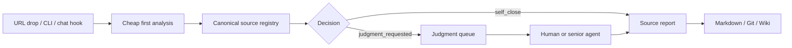

# Webpage Sorter

Sort URLs before your agent burns tokens on them.


Webpage Sorter is a cheap-first intake layer for AI agents. Drop in a URL; it normalizes the source, runs a low-cost first pass, stores evidence, and only escalates pages that actually need judgment.

Use it before RAG, wiki building, research agents, or Slack/Discord URL collectors. The point is simple: most URLs do not deserve a full reasoning run.

## The problem

Agents are bad at saying "not worth reading yet." Give them a link and they tend to start researching, summarizing, indexing, or chatting about it. That gets expensive fast.

Webpage Sorter adds a gate in front:

```text
URL in → cheap triage → structured record → decision
```

The decision is explicit:

- `self_close`: enough evidence, no escalation needed
- `judgment_requested`: uncertain, valuable, risky, or worth human/senior-agent review
- `archive`: approved for preservation
- `reject` / `blocked`: not useful or inaccessible

The database stays the source of truth. Markdown and wiki pages are human-readable projections.

## What it gives you

- A SQLite demo that runs with no credentials
- A Hermes plugin with `webpage_sorter_*` tool aliases
- Legacy `source_lab_*` tool names for compatibility
- Cheap-first URL analysis hooks
- A judgment queue for uncertain pages
- Markdown/Git projection for source reports and queue pages
- Optional PostgreSQL storage for production collector flows
- A deterministic Slack auto-intake hook for collector profiles

## Architecture



## Quickstart: no Slack, no Postgres, no LLM key

The demo uses SQLite and deterministic local analysis. It does not need Slack, PostgreSQL, credentials, or a live model provider.

```bash
git clone https://github.com/yong2bba/webpage-sorter.git
cd webpage-sorter
python3 -m pytest -q
python3 -m webpage_sorter_cli demo https://github.com/D4Vinci/Scrapling --db-path out/demo.db --out-dir out
python3 -m webpage_sorter_cli queue --db-path out/demo.db
```

Generated files:

```text
out/demo.db
out/sourcelab/sources/github/d4vinci-scrapling.md
out/sourcelab/queue/judgmentrequested.md
```

Try a low-confidence page to see the judgment queue path:

```bash
python3 -m webpage_sorter_cli demo https://example.com/uncertain --confidence 0.2 --db-path out/demo.db --out-dir out
python3 -m webpage_sorter_cli queue --db-path out/demo.db
```

## Package status

This repo is the first public extraction from a working SourceLab collector. Some internals still use `source_lab_*` names because the original runtime depended on them. The public project name is Webpage Sorter, and new Hermes-facing aliases are registered as `webpage_sorter_*`.

Included:

- Hermes plugin entrypoint: `__init__.py`
- Core intake, branching, validation, and storage logic: `source_lab_core/`
- SQLite queue storage
- Optional PostgreSQL collector flow storage
- Markdown/Git wiki projection
- Slack deterministic auto-intake hook
- SQLite-only demo CLI: `webpage_sorter_cli.py`
- Tests and GitHub Actions
- Sanitized operational smoke report

Not included:

- `.env` files
- Slack tokens or signing secrets
- database credentials
- private runtime logs
- local Hermes profile directories

## Hermes plugin setup

Link the repo into your Hermes plugin directory:

```bash
mkdir -p ~/.hermes/plugins
ln -s /path/to/webpage-sorter ~/.hermes/plugins/webpage_sorter
hermes tools | grep webpage_sorter
```

For a dedicated collector profile:

```bash
mkdir -p ~/.hermes/profiles/collector/plugins
ln -s /path/to/webpage-sorter ~/.hermes/profiles/collector/plugins/webpage_sorter
hermes --profile collector tools | grep webpage_sorter
```

Registered tool names:

```text
webpage_sorter_analyze_url
webpage_sorter_intake_url
webpage_sorter_queue_list
webpage_sorter_process_result
```

Legacy compatibility names:

```text
source_lab_analyze_url
source_lab_intake_url
source_lab_queue_list
source_lab_process_result
```

## Environment

See `.env.example`.

SQLite works by default. PostgreSQL is optional:

```bash
WEBPAGE_SORTER_DATABASE_URL=<postgres connection string>
```

Legacy `SOURCELAB_*` environment names are still accepted for compatibility with the original collector.

## Tests

```bash
python3 -m pytest -q
```

PostgreSQL tests are skipped unless `SOURCELAB_TEST_DATABASE_URL` is set.

## Operational proof

A sanitized smoke report lives here:

```text
docs/operations/slack-auto-intake-smoke-2026-06-01.md
```

It verifies this production path:

```text
Slack live message
→ deterministic pre_gateway_dispatch hook
→ low-cost URL analysis
→ PostgreSQL write
→ source report projection
→ queue projection
→ public wiki rendering
```

## License

MIT. See [LICENSE](LICENSE).
