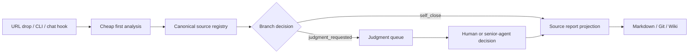

# Webpage Sorter

A token-frugal webpage intake and judgment queue for AI agents.


Webpage Sorter helps an agent avoid spending expensive reasoning tokens on every URL. It performs a cheap first pass, stores structured evidence, and escalates only uncertain or valuable pages to a judgment queue.

## Why

Agents waste tokens when every dropped URL is handled as a full conversation or deep research task. Most pages can be classified cheaply:

- `self_close`: obvious, enough evidence, no escalation needed
- `judgment_requested`: uncertain, valuable, risky, or needs human/senior-agent review
- `archive`: approved for long-term preservation
- `reject` / `blocked`: not useful or inaccessible

Webpage Sorter is an intake control plane before RAG, wiki-building, or long-form research.

## Architecture



The database is the source of truth. Markdown/wiki pages are projections for humans.

## Quickstart

The SQLite-only demo uses deterministic local analysis. It does **not** need Slack, PostgreSQL, credentials, or a live LLM provider.

```bash
git clone https://github.com/yong2bba/webpage-sorter.git
cd webpage-sorter
python3 -m pytest -q
python3 -m webpage_sorter_cli demo https://github.com/D4Vinci/Scrapling --db-path out/demo.db --out-dir out
python3 -m webpage_sorter_cli queue --db-path out/demo.db
```

Generated artifacts:

```text
out/demo.db
out/sourcelab/sources/github/d4vinci-scrapling.md
out/sourcelab/queue/judgmentrequested.md
```

To see a pending judgment queue item:

```bash
python3 -m webpage_sorter_cli demo https://example.com/uncertain --confidence 0.2 --db-path out/demo.db --out-dir out
python3 -m webpage_sorter_cli queue --db-path out/demo.db
```

## Current package shape

This repository is the first extraction from a working SourceLab collector. Some module/tool names still use `source_lab_*` for compatibility with the original Hermes plugin, while the project name and product direction are **Webpage Sorter**. New Hermes tool aliases are also registered as `webpage_sorter_*`.

Included:

- Hermes plugin entrypoint: `__init__.py`
- Core intake/branching/storage logic: `source_lab_core/`
- SQLite queue storage
- PostgreSQL collector flow
- Markdown/Git wiki projection
- Slack deterministic auto-intake hook
- SQLite-only demo CLI: `webpage_sorter_cli.py`
- Tests and GitHub Actions
- Sanitized operational smoke report

Not included:

- `.env` files
- Slack tokens or signing secrets
- database credentials
- private runtime logs
- local profile directories

## Minimal Hermes plugin setup

```bash
mkdir -p ~/.hermes/plugins
ln -s /path/to/webpage-sorter ~/.hermes/plugins/webpage_sorter
hermes tools | grep webpage_sorter
```

For a dedicated collector profile, link it into that profile's plugin directory instead:

```bash
mkdir -p ~/.hermes/profiles/collector/plugins
ln -s /path/to/webpage-sorter ~/.hermes/profiles/collector/plugins/webpage_sorter
hermes --profile collector tools | grep webpage_sorter
```

Registered tool names:

```text
webpage_sorter_analyze_url
webpage_sorter_intake_url
webpage_sorter_queue_list
webpage_sorter_process_result
```

Legacy compatibility names remain available:

```text
source_lab_analyze_url
source_lab_intake_url
source_lab_queue_list
source_lab_process_result
```

## Environment

See `.env.example`.

Core storage can run with SQLite by default. PostgreSQL is optional:

```bash
WEBPAGE_SORTER_DATABASE_URL=<postgres connection string>
```

Legacy `SOURCELAB_*` environment names are still accepted by the extracted plugin for compatibility.

## Tests

```bash
python3 -m pytest -q
```

PostgreSQL tests are skipped unless `SOURCELAB_TEST_DATABASE_URL` is set.

## Operational proof

The sanitized smoke report is in:

```text
docs/operations/slack-auto-intake-smoke-2026-06-01.md
```

It verifies the path:

```text
Slack live message
→ deterministic pre_gateway_dispatch hook
→ low-cost URL analysis
→ PostgreSQL write
→ source report projection
→ queue projection
→ public wiki rendering
```

## License

MIT. See [LICENSE](LICENSE).
